# SPPU DSAL Practical Guide
## Complete Guide for Oral Practical Exam with Algorithms & Flowcharts

### Student: Himanshu Haridas Hande (Roll No. 16)
### Subject: Data Structures and Algorithms Laboratory (DSAL)
### University: Savitribai Phule Pune University (SPPU)

---

## Table of Contents
1. [Telephone Book Database using Hash Table](#practical-1)
2. [Dictionary ADT using Hashing](#practical-2)
3. [Book Structure using Tree](#practical-3)
4. [Binary Search Tree Construction](#practical-4)
5. [Expression Tree from Prefix](#practical-5)
6. [Threaded Binary Tree](#practical-6)
7. [Graph using Adjacency Matrix - DFS & BFS](#practical-7)
8. [Flight Paths Between Cities](#practical-8)
9. [Dictionary using Height Balanced Tree (AVL)](#practical-9)
10. [Heap Data Structure for Max/Min Marks](#practical-10)
11. [Sequential File - Student Information](#practical-11)
12. [Indexed Sequential File - Employee Information](#practical-12)

---

## Practical 1: Telephone Book Database using Hash Table {#practical-1}

### Concept Explanation
A **Hash Table** is a data structure that provides O(1) average-case time complexity for search, insert, and delete operations. It uses a hash function to map keys (names) to array indices where values (phone numbers) are stored.

**Key Concepts:**
- **Hash Function**: Transforms a key into an array index
- **Collision**: When two keys hash to the same index
- **Load Factor**: Number of entries / Table size

### Algorithm: Linear Probing Insertion
```
ALGORITHM: Insert_Linear_Probing(key, value)
1. START
2. Calculate index = hash_function(key)
3. SET original_index = index
4. SET comparisons = 0
5. REPEAT
   a. INCREMENT comparisons
   b. IF table[index] is empty THEN
      - SET table[index] = {key, value, occupied=true}
      - PRINT "Inserted at index", index, "with", comparisons, "comparisons"
      - RETURN
   c. ELSE
      - SET index = (index + 1) % table_size
6. UNTIL index == original_index
7. PRINT "Hash table is full"
8. END
```

### Algorithm: Search Operation
```
ALGORITHM: Search_Linear_Probing(key)
1. START
2. Calculate index = hash_function(key)
3. SET original_index = index
4. SET comparisons = 0
5. REPEAT
   a. INCREMENT comparisons
   b. IF table[index] is occupied AND table[index].key == key THEN
      - PRINT "Found:", table[index].value
      - PRINT "Comparisons:", comparisons
      - RETURN
   c. IF table[index] is empty THEN
      - BREAK
   d. SET index = (index + 1) % table_size
6. UNTIL index == original_index
7. PRINT "Not found. Comparisons:", comparisons
8. END
```

### Flowchart: Hash Table Operations
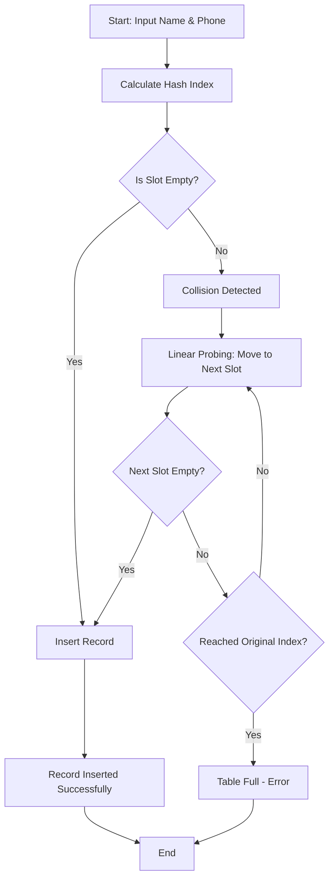
```mermaid
flowchart TD
    A[Start: Input Name & Phone] --> B[Calculate Hash Index]
    B --> C{Is Slot Empty?}
    C -->|Yes| D[Insert Record]
    C -->|No| E[Collision Detected]
    E --> F[Linear Probing: Move to Next Slot]
    F --> G{Next Slot Empty?}
    G -->|Yes| D
    G -->|No| H{Reached Original Index?}
    H -->|No| F
    H -->|Yes| I[Table Full - Error]
    D --> J[Record Inserted Successfully]
    I --> K[End]
    J --> K
```

### Time Complexity Analysis
- **Best Case**: O(1) - No collision
- **Average Case**: O(1/(1-α)) where α is load factor
- **Worst Case**: O(n) - All elements hash to same location

---

## Practical 2: Dictionary ADT using Hashing with Chaining {#practical-2}

### Concept Explanation
**Dictionary ADT** implements key-value storage using **separate chaining** to handle collisions. Each hash table slot contains a linked list of entries that hash to the same index.

**Advantages of Chaining:**
- No clustering problem
- Can handle more than n elements
- Simple deletion

### Algorithm: Insert with Chaining
```
ALGORITHM: Insert_Chaining(key, value)
1. START
2. Calculate index = hash_function(key)
3. CREATE new_node with key and value
4. SET new_node.next = table[index]
5. SET table[index] = new_node
6. PRINT "Inserted:", key, "at index", index
7. END
```

### Algorithm: Search with Chaining
```
ALGORITHM: Search_Chaining(key)
1. START
2. Calculate index = hash_function(key)
3. SET current = table[index]
4. WHILE current != NULL DO
   a. IF current.key == key THEN
      - PRINT "Found:", current.key, "=", current.value
      - RETURN
   b. SET current = current.next
5. PRINT "Key not found"
6. END
```

### Algorithm: Delete with Chaining
```
ALGORITHM: Delete_Chaining(key)
1. START
2. Calculate index = hash_function(key)
3. SET current = table[index]
4. SET previous = NULL
5. WHILE current != NULL AND current.key != key DO
   a. SET previous = current
   b. SET current = current.next
6. IF current == NULL THEN
   - PRINT "Key not found"
   - RETURN
7. IF previous == NULL THEN
   - SET table[index] = current.next
8. ELSE
   - SET previous.next = current.next
9. DELETE current
10. PRINT "Deleted:", key
11. END
```

### Flowchart: Dictionary with Chaining
```mermaid
flowchart TD
    A[Start: Input Key-Value] --> B[Calculate Hash Index]
    B --> C{Operation Type?}
    C -->|Insert| D[Create New Node]
    D --> E[Add to Front of Chain]
    E --> F[Update Table[index]]
    C -->|Search| G[Traverse Chain at Index]
    G --> H{Key Found?}
    H -->|Yes| I[Return Value]
    H -->|No| J[Key Not Found]
    C -->|Delete| K[Find Node in Chain]
    K --> L{Node Found?}
    L -->|Yes| M[Remove from Chain]
    L -->|No| N[Not Found]
    F --> O[End]
    I --> O
    J --> O
    M --> O
    N --> O
```

### Time Complexity Analysis
- **Average Case**: O(1 + α) where α = load factor
- **Worst Case**: O(n) when all keys hash to same index

---

## Practical 3: Book Structure using Tree {#practical-3}

### Concept Explanation
A **tree structure** perfectly represents hierarchical data like a book organization. Each node can have multiple children, representing the relationship between book components.

**Tree Terminology:**
- **Root**: Book (top level)
- **Internal Nodes**: Chapters, Sections
- **Leaves**: Subsections (no children)
- **Height**: Longest path from root to leaf

### Algorithm: Create Book Tree
```
ALGORITHM: Create_Book_Structure()
1. START
2. CREATE root_node as "Book Title"
3. FOR each chapter DO
   a. CREATE chapter_node
   b. ADD chapter_node as child of root
   c. FOR each section in chapter DO
      - CREATE section_node
      - ADD section_node as child of chapter_node
      - FOR each subsection in section DO
         * CREATE subsection_node
         * ADD subsection_node as child of section_node
4. RETURN root_node
5. END
```

### Algorithm: Print Tree Structure
```
ALGORITHM: Print_Tree(node, level)
1. START
2. IF node == NULL THEN RETURN
3. FOR i = 1 to level DO
   - PRINT "  " (indentation)
4. PRINT "- ", node.title
5. Print_Tree(node.child, level + 1)
6. Print_Tree(node.sibling, level)
7. END
```

### Algorithm: Calculate Tree Properties
```
ALGORITHM: Calculate_Height(node)
1. START
2. IF node == NULL THEN RETURN 0
3. SET child_height = Calculate_Height(node.child)
4. SET sibling_height = Calculate_Height(node.sibling)
5. RETURN MAX(child_height + 1, sibling_height)
6. END

ALGORITHM: Count_Nodes(node)
1. START
2. IF node == NULL THEN RETURN 0
3. RETURN 1 + Count_Nodes(node.child) + Count_Nodes(node.sibling)
4. END
```

### Flowchart: Book Tree Construction
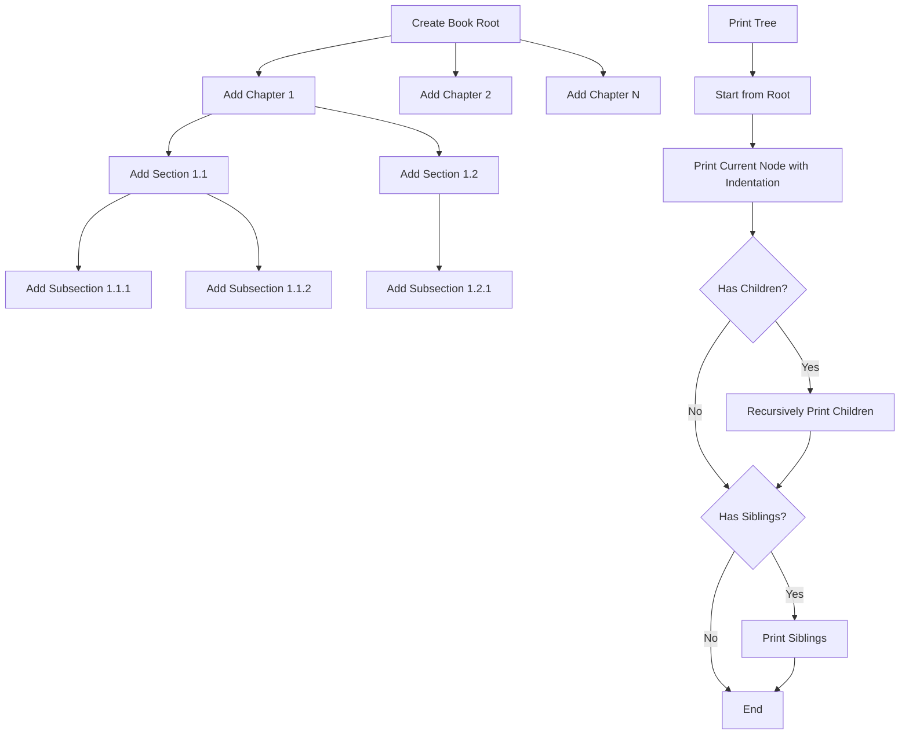
```mermaid
flowchart TD
    A[Create Book Root] --> B[Add Chapter 1]
    A --> C[Add Chapter 2]
    A --> D[Add Chapter N]
    B --> E[Add Section 1.1]
    B --> F[Add Section 1.2]
    E --> G[Add Subsection 1.1.1]
    E --> H[Add Subsection 1.1.2]
    F --> I[Add Subsection 1.2.1]

    J[Print Tree] --> K[Start from Root]
    K --> L[Print Current Node with Indentation]
    L --> M{Has Children?}
    M -->|Yes| N[Recursively Print Children]
    M -->|No| O{Has Siblings?}
    N --> O
    O -->|Yes| P[Print Siblings]
    O -->|No| Q[End]
    P --> Q
```

### Space and Time Analysis
- **Space Complexity**: O(n) where n = number of nodes
- **Tree Traversal**: O(n) - visit each node once
- **Height Calculation**: O(n) in worst case

---

## Practical 4: Binary Search Tree (BST) Construction {#practical-4}

### Concept Explanation
A **Binary Search Tree** maintains the property that for any node:
- All values in left subtree < node's value
- All values in right subtree > node's value
- Both subtrees are also BSTs

This property enables efficient O(log n) operations in balanced trees.

### Algorithm: BST Insertion
```
ALGORITHM: Insert_BST(root, data)
1. START
2. IF root == NULL THEN
   - CREATE new_node with data
   - RETURN new_node
3. IF data < root.data THEN
   - SET root.left = Insert_BST(root.left, data)
4. ELSE IF data > root.data THEN
   - SET root.right = Insert_BST(root.right, data)
5. RETURN root
6. END
```

### Algorithm: BST Search
```
ALGORITHM: Search_BST(root, key)
1. START
2. IF root == NULL THEN RETURN false
3. IF root.data == key THEN RETURN true
4. IF key < root.data THEN
   - RETURN Search_BST(root.left, key)
5. ELSE
   - RETURN Search_BST(root.right, key)
6. END
```

### Algorithm: Find Minimum/Maximum
```
ALGORITHM: Find_Min(root)
1. START
2. IF root == NULL THEN RETURN NULL
3. WHILE root.left != NULL DO
   - SET root = root.left
4. RETURN root.data
5. END

ALGORITHM: Find_Max(root)
1. START
2. IF root == NULL THEN RETURN NULL
3. WHILE root.right != NULL DO
   - SET root = root.right
4. RETURN root.data
5. END
```

### Algorithm: Tree Traversals
```
ALGORITHM: Inorder_Traversal(root)
1. START
2. IF root != NULL THEN
   a. Inorder_Traversal(root.left)
   b. PRINT root.data
   c. Inorder_Traversal(root.right)
3. END

ALGORITHM: Preorder_Traversal(root)
1. START
2. IF root != NULL THEN
   a. PRINT root.data
   b. Preorder_Traversal(root.left)
   c. Preorder_Traversal(root.right)
3. END

ALGORITHM: Postorder_Traversal(root)
1. START
2. IF root != NULL THEN
   a. Postorder_Traversal(root.left)
   b. Postorder_Traversal(root.right)
   c. PRINT root.data
3. END
```

### Flowchart: BST Operations
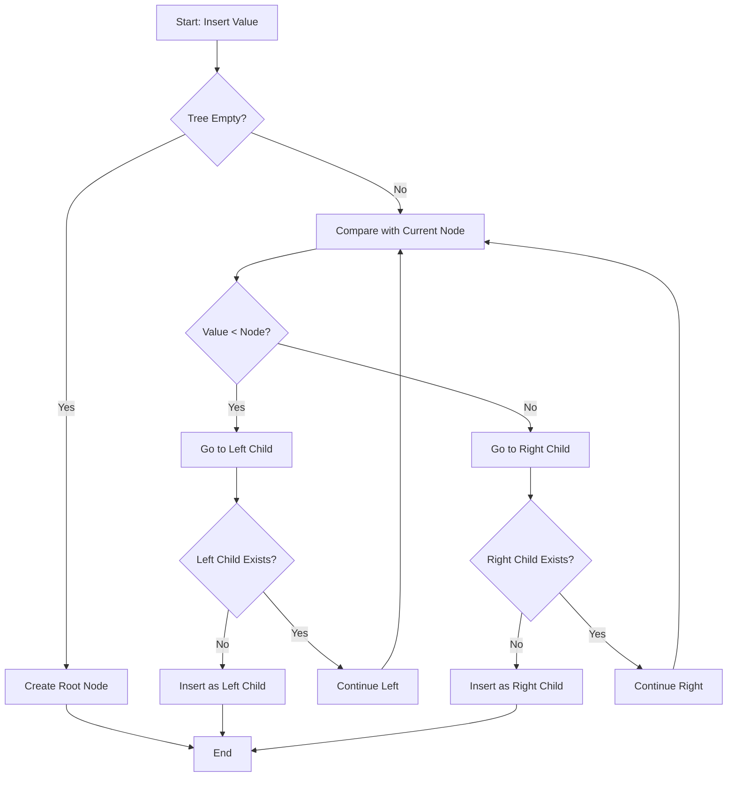
```mermaid
flowchart TD
    A[Start: Insert Value] --> B{Tree Empty?}
    B -->|Yes| C[Create Root Node]
    B -->|No| D[Compare with Current Node]
    D --> E{Value < Node?}
    E -->|Yes| F[Go to Left Child]
    E -->|No| G[Go to Right Child]
    F --> H{Left Child Exists?}
    G --> I{Right Child Exists?}
    H -->|No| J[Insert as Left Child]
    H -->|Yes| K[Continue Left]
    I -->|No| L[Insert as Right Child]
    I -->|Yes| M[Continue Right]
    K --> D
    M --> D
    C --> N[End]
    J --> N
    L --> N
```

### Tree Mirror Algorithm
```
ALGORITHM: Mirror_BST(root)
1. START
2. IF root == NULL THEN RETURN
3. SWAP root.left and root.right
4. Mirror_BST(root.left)
5. Mirror_BST(root.right)
6. END
```

### Time Complexity Analysis
- **Balanced BST**: O(log n) for all operations
- **Skewed BST**: O(n) for all operations
- **Space**: O(n) for storage, O(h) for recursion where h = height

---

## Practical 5: Expression Tree from Prefix Expression {#practical-5}

### Concept Explanation
An **Expression Tree** represents mathematical expressions where:
- **Leaf nodes**: Operands (variables/numbers)
- **Internal nodes**: Operators (+, -, *, /, ^)
- **Tree evaluation**: Post-order gives postfix expression

**Prefix Expression**: Operator precedes operands (e.g., +AB means A+B)

### Algorithm: Construct from Prefix
```
ALGORITHM: Construct_Expression_Tree(prefix)
1. START
2. CREATE empty stack
3. SET length = length of prefix string
4. FOR i = length-1 DOWN TO 0 DO
   a. SET char = prefix[i]
   b. IF char is operand THEN
      - CREATE node with char
      - PUSH node to stack
   c. ELSE IF char is operator THEN
      - CREATE node with char
      - POP two nodes from stack as left and right children
      - SET node.left = first popped node
      - SET node.right = second popped node
      - PUSH node to stack
5. SET root = top of stack
6. RETURN root
7. END
```

### Algorithm: Non-Recursive Postorder
```
ALGORITHM: Postorder_Non_Recursive(root)
1. START
2. IF root == NULL THEN RETURN
3. CREATE stack1 and stack2
4. PUSH root to stack1
5. WHILE stack1 is not empty DO
   a. SET temp = POP from stack1
   b. PUSH temp to stack2
   c. IF temp.left exists THEN PUSH temp.left to stack1
   d. IF temp.right exists THEN PUSH temp.right to stack1
6. WHILE stack2 is not empty DO
   a. SET node = POP from stack2
   b. PRINT node.data
7. END
```

### Algorithm: Tree Deletion
```
ALGORITHM: Delete_Tree(root)
1. START
2. IF root == NULL THEN RETURN
3. Delete_Tree(root.left)
4. Delete_Tree(root.right)
5. DELETE root
6. END
```

### Flowchart: Expression Tree Construction
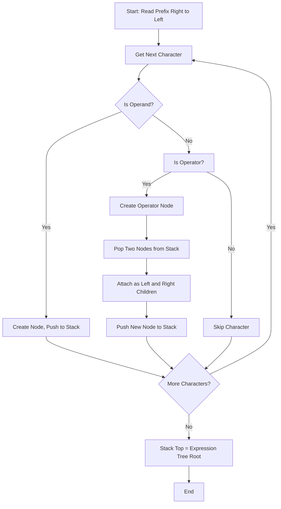
```mermaid
flowchart TD
    A[Start: Read Prefix Right to Left] --> B[Get Next Character]
    B --> C{Is Operand?}
    C -->|Yes| D[Create Node, Push to Stack]
    C -->|No| E[Is Operator?]
    E -->|Yes| F[Create Operator Node]
    F --> G[Pop Two Nodes from Stack]
    G --> H[Attach as Left and Right Children]
    H --> I[Push New Node to Stack]
    E -->|No| J[Skip Character]
    D --> K{More Characters?}
    I --> K
    J --> K
    K -->|Yes| B
    K -->|No| L[Stack Top = Expression Tree Root]
    L --> M[End]
```

### Postorder Traversal Flowchart
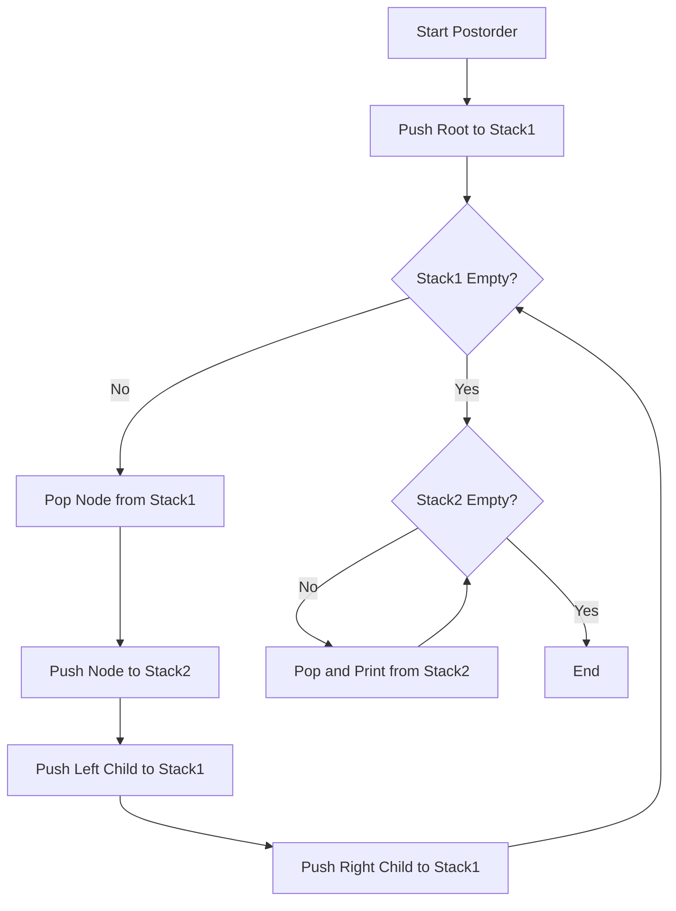
```mermaid
flowchart TD
    A[Start Postorder] --> B[Push Root to Stack1]
    B --> C{Stack1 Empty?}
    C -->|No| D[Pop Node from Stack1]
    D --> E[Push Node to Stack2]
    E --> F[Push Left Child to Stack1]
    F --> G[Push Right Child to Stack1]
    G --> C
    C -->|Yes| H{Stack2 Empty?}
    H -->|No| I[Pop and Print from Stack2]
    I --> H
    H -->|Yes| J[End]
```

### Time Complexity Analysis
- **Construction**: O(n) where n = number of characters
- **Traversal**: O(n) for visiting all nodes
- **Space**: O(n) for tree storage + O(h) for stack

---

## Practical 6: Threaded Binary Tree {#practical-6}

### Concept Explanation
A **Threaded Binary Tree** optimizes tree traversal by replacing NULL pointers with "threads" that point to:
- **Inorder Predecessor** (left thread)
- **Inorder Successor** (right thread)

**Benefits:**
- No recursion needed for inorder traversal
- No stack required
- Efficient memory usage

### Algorithm: Threaded BST Insertion
```
ALGORITHM: Insert_Threaded_BST(root, data)
1. START
2. CREATE new_node with data
3. SET new_node.leftThread = new_node.rightThread = true
4. IF root == NULL THEN RETURN new_node
5. SET current = root, parent = NULL
6. WHILE current != NULL DO
   a. SET parent = current
   b. IF data < current.data THEN
      - IF current.leftThread == false THEN
         SET current = current.left
      - ELSE BREAK
   c. ELSE IF data > current.data THEN
      - IF current.rightThread == false THEN
         SET current = current.right
      - ELSE BREAK
   d. ELSE RETURN root (duplicate)
7. IF data < parent.data THEN
   a. SET new_node.left = parent.left
   b. SET new_node.right = parent
   c. SET parent.leftThread = false
   d. SET parent.left = new_node
8. ELSE
   a. SET new_node.right = parent.right
   b. SET new_node.left = parent
   c. SET parent.rightThread = false
   d. SET parent.right = new_node
9. RETURN root
10. END
```

### Algorithm: Find Leftmost Node
```
ALGORITHM: Find_Leftmost(node)
1. START
2. IF node == NULL THEN RETURN NULL
3. WHILE node.leftThread == false DO
   - SET node = node.left
4. RETURN node
5. END
```

### Algorithm: Inorder Traversal (Threaded)
```
ALGORITHM: Inorder_Threaded(root)
1. START
2. IF root == NULL THEN
   - PRINT "Empty tree"
   - RETURN
3. SET current = Find_Leftmost(root)
4. WHILE current != NULL DO
   a. PRINT current.data
   b. IF current.rightThread == true THEN
      - SET current = current.right
   c. ELSE
      - SET current = Find_Leftmost(current.right)
5. END
```

### Flowchart: Threaded BST Operations
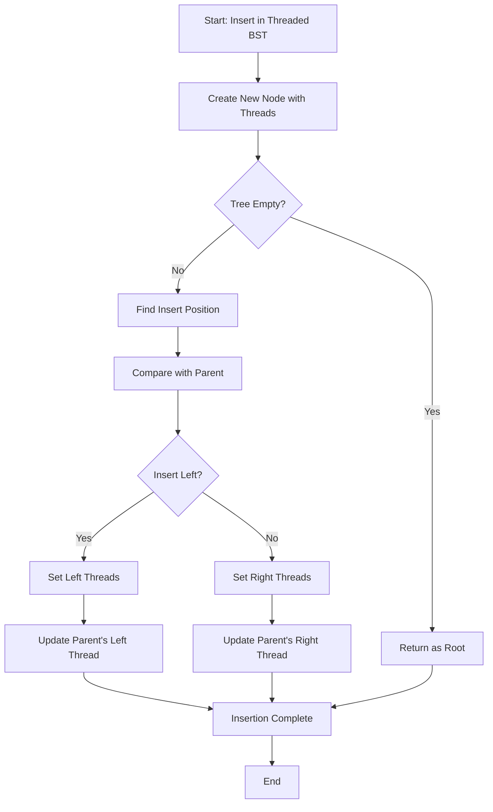
```mermaid
flowchart TD
    A[Start: Insert in Threaded BST] --> B[Create New Node with Threads]
    B --> C{Tree Empty?}
    C -->|Yes| D[Return as Root]
    C -->|No| E[Find Insert Position]
    E --> F[Compare with Parent]
    F --> G{Insert Left?}
    G -->|Yes| H[Set Left Threads]
    H --> I[Update Parent's Left Thread]
    G -->|No| J[Set Right Threads]
    J --> K[Update Parent's Right Thread]
    I --> L[Insertion Complete]
    K --> L
    D --> L
    L --> M[End]
```

### Inorder Traversal Flowchart
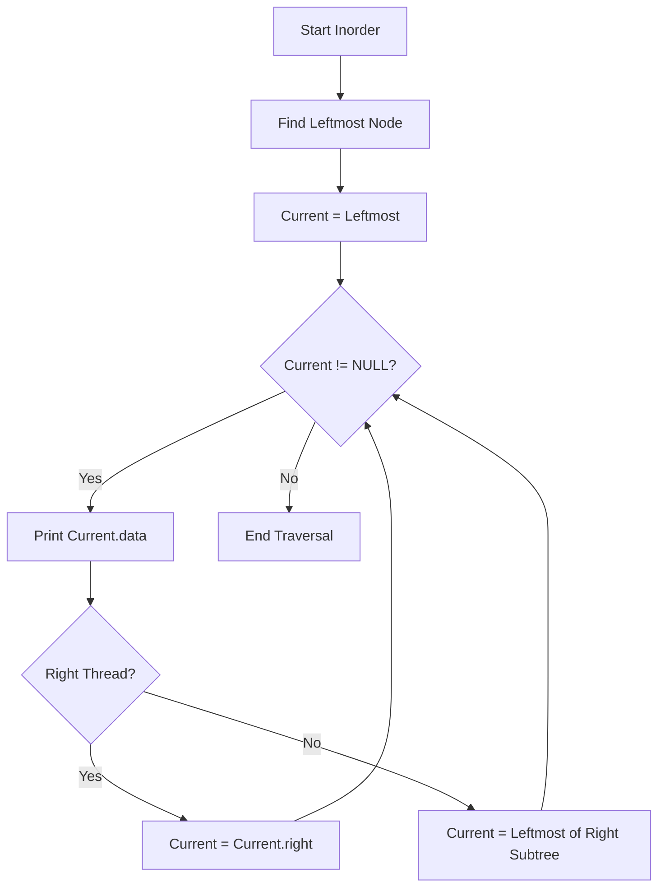
```mermaid
flowchart TD
    A[Start Inorder] --> B[Find Leftmost Node]
    B --> C[Current = Leftmost]
    C --> D{Current != NULL?}
    D -->|Yes| E[Print Current.data]
    E --> F{Right Thread?}
    F -->|Yes| G[Current = Current.right]
    F -->|No| H[Current = Leftmost of Right Subtree]
    G --> D
    H --> D
    D -->|No| I[End Traversal]
```

### Time Complexity Analysis
- **Insertion**: O(log n) average, O(n) worst case
- **Inorder Traversal**: O(n) without recursion stack
- **Space**: O(1) additional space for traversal

---

## Practical 7: Graph using Adjacency Matrix - DFS & BFS {#practical-7}

### Concept Explanation
A **Graph** G = (V, E) consists of vertices V and edges E. **Adjacency Matrix** representation uses a 2D array where `matrix[i][j] = 1` indicates an edge between vertex i and j.

**Graph Traversal Algorithms:**
- **DFS (Depth-First Search)**: Goes as deep as possible before backtracking
- **BFS (Breadth-First Search)**: Explores neighbors level by level

### Algorithm: Add Edge
```
ALGORITHM: Add_Edge(u, v)
1. START
2. SET adjMatrix[u][v] = 1
3. SET adjMatrix[v][u] = 1  // For undirected graph
4. END
```

### Algorithm: DFS Traversal
```
ALGORITHM: DFS(vertex, visited[])
1. START
2. SET visited[vertex] = true
3. PRINT vertex
4. FOR i = 0 TO vertices-1 DO
   a. IF adjMatrix[vertex][i] == 1 AND visited[i] == false THEN
      - DFS(i, visited[])
5. END

ALGORITHM: DFS_Main(start_vertex)
1. START
2. CREATE visited[] array initialized to false
3. PRINT "DFS Traversal:"
4. CALL DFS(start_vertex, visited[])
5. END
```

### Algorithm: BFS Traversal
```
ALGORITHM: BFS(start_vertex)
1. START
2. CREATE visited[] array initialized to false
3. CREATE empty queue
4. SET visited[start_vertex] = true
5. ENQUEUE start_vertex
6. PRINT "BFS Traversal:"
7. WHILE queue is not empty DO
   a. SET vertex = DEQUEUE
   b. PRINT vertex
   c. FOR i = 0 TO vertices-1 DO
      - IF adjMatrix[vertex][i] == 1 AND visited[i] == false THEN
        * SET visited[i] = true
        * ENQUEUE i
8. END
```

### Flowchart: DFS Algorithm
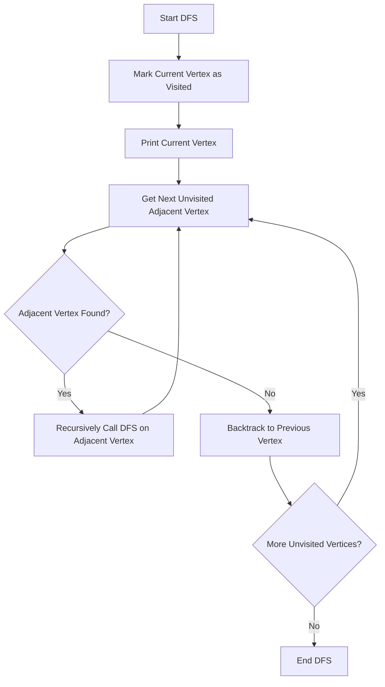
```mermaid
flowchart TD
    A[Start DFS] --> B[Mark Current Vertex as Visited]
    B --> C[Print Current Vertex]
    C --> D[Get Next Unvisited Adjacent Vertex]
    D --> E{Adjacent Vertex Found?}
    E -->|Yes| F[Recursively Call DFS on Adjacent Vertex]
    F --> D
    E -->|No| G[Backtrack to Previous Vertex]
    G --> H{More Unvisited Vertices?}
    H -->|Yes| D
    H -->|No| I[End DFS]
```

### Flowchart: BFS Algorithm
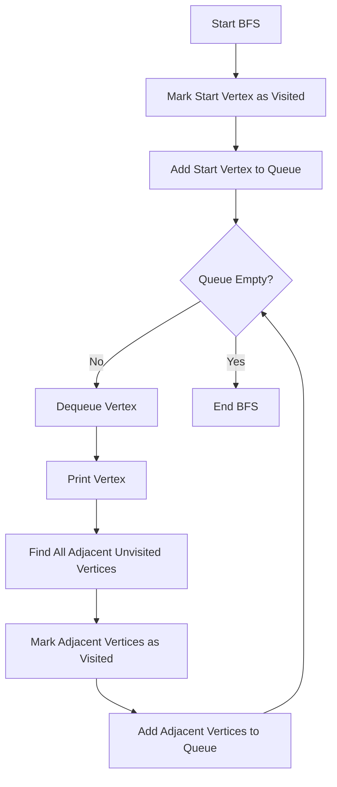
```mermaid
flowchart TD
    A[Start BFS] --> B[Mark Start Vertex as Visited]
    B --> C[Add Start Vertex to Queue]
    C --> D{Queue Empty?}
    D -->|No| E[Dequeue Vertex]
    E --> F[Print Vertex]
    F --> G[Find All Adjacent Unvisited Vertices]
    G --> H[Mark Adjacent Vertices as Visited]
    H --> I[Add Adjacent Vertices to Queue]
    I --> D
    D -->|Yes| J[End BFS]
```

### Adjacency Matrix Structure
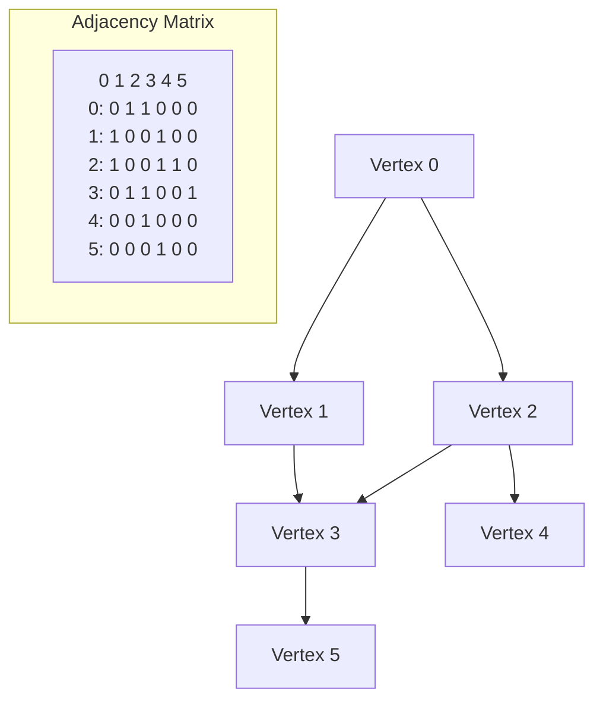
```mermaid
graph TD
    A[Vertex 0] --> B[Vertex 1]
    A --> C[Vertex 2]
    B --> D[Vertex 3]
    C --> D
    C --> E[Vertex 4]
    D --> F[Vertex 5]

    subgraph "Adjacency Matrix"
    G["   0 1 2 3 4 5<br/>0: 0 1 1 0 0 0<br/>1: 1 0 0 1 0 0<br/>2: 1 0 0 1 1 0<br/>3: 0 1 1 0 0 1<br/>4: 0 0 1 0 0 0<br/>5: 0 0 0 1 0 0"]
    end
```

### Time Complexity Analysis
- **DFS**: O(V²) with adjacency matrix, O(V + E) with adjacency list
- **BFS**: O(V²) with adjacency matrix, O(V + E) with adjacency list
- **Space**: O(V²) for adjacency matrix, O(V) for visited array

---

## Practical 8: Flight Paths Between Cities (Weighted Graph) {#practical-8}

### Concept Explanation
This practical models cities as **vertices** and flight paths as **weighted edges**. Edge weights represent flight time, distance, or fuel cost. We use **adjacency lists** for efficient storage of sparse graphs.

### Algorithm: Add Flight Path
```
ALGORITHM: Add_Flight(src, dest, time)
1. START
2. CREATE edge1 with destination = dest, weight = time
3. ADD edge1 to adjList[src]
4. CREATE edge2 with destination = src, weight = time
5. ADD edge2 to adjList[dest]  // For undirected graph
6. END
```

### Algorithm: Display Flight Network
```
ALGORITHM: Display_Flight_Network()
1. START
2. FOR i = 0 TO vertices-1 DO
   a. PRINT "City", i, ":"
   b. FOR each edge in adjList[i] DO
      - PRINT "-> City", edge.dest, "(Time:", edge.weight, ")"
   c. PRINT newline
3. END
```

### Algorithm: Check Connectivity
```
ALGORITHM: Is_Connected()
1. START
2. CREATE visited[] array initialized to false
3. CALL DFS_Connectivity(0, visited[])
4. FOR i = 0 TO vertices-1 DO
   a. IF visited[i] == false THEN
      - RETURN false
5. RETURN true
6. END

ALGORITHM: DFS_Connectivity(vertex, visited[])
1. START
2. SET visited[vertex] = true
3. FOR each edge in adjList[vertex] DO
   a. IF visited[edge.dest] == false THEN
      - CALL DFS_Connectivity(edge.dest, visited[])
4. END
```

### Algorithm: Find Shortest Path (Dijkstra)
```
ALGORITHM: Dijkstra_Shortest_Path(source)
1. START
2. CREATE distance[] array, initialize all to INFINITY
3. CREATE visited[] array, initialize all to false
4. SET distance[source] = 0
5. FOR count = 0 TO vertices-1 DO
   a. SET u = vertex with minimum distance and not visited
   b. SET visited[u] = true
   c. FOR each edge adjacent to u DO
      - SET v = edge.dest, weight = edge.weight
      - IF visited[v] == false AND distance[u] + weight < distance[v] THEN
        * SET distance[v] = distance[u] + weight
6. PRINT all shortest distances from source
7. END
```

### Flowchart: Flight Network Operations
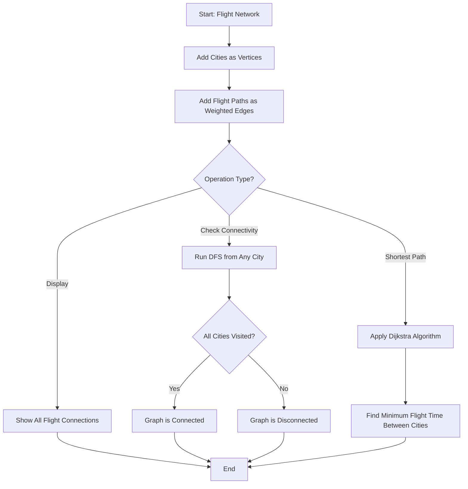
```mermaid
flowchart TD
    A[Start: Flight Network] --> B[Add Cities as Vertices]
    B --> C[Add Flight Paths as Weighted Edges]
    C --> D{Operation Type?}
    D -->|Display| E[Show All Flight Connections]
    D -->|Check Connectivity| F[Run DFS from Any City]
    F --> G{All Cities Visited?}
    G -->|Yes| H[Graph is Connected]
    G -->|No| I[Graph is Disconnected]
    D -->|Shortest Path| J[Apply Dijkstra Algorithm]
    J --> K[Find Minimum Flight Time Between Cities]
    E --> L[End]
    H --> L
    I --> L
    K --> L
```

### Graph Connectivity Check
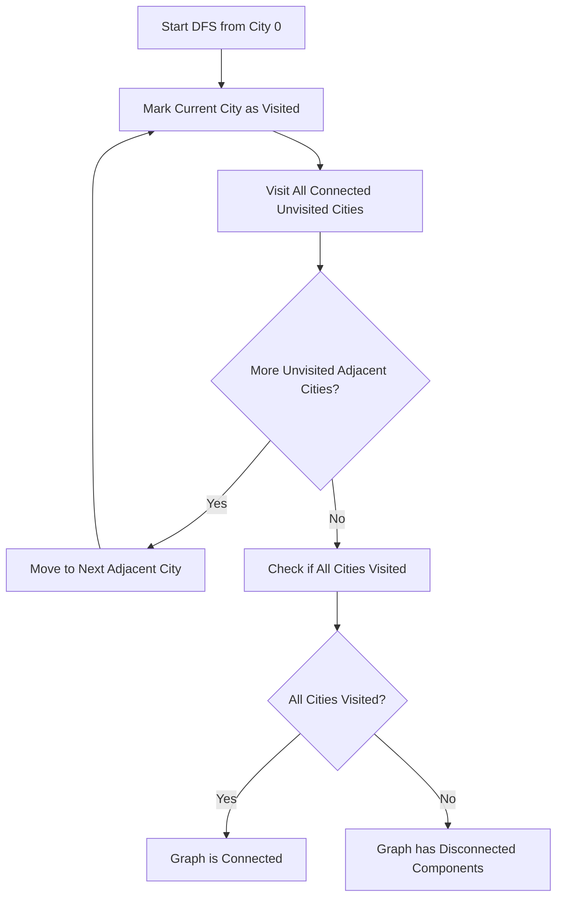
```mermaid
flowchart TD
    A[Start DFS from City 0] --> B[Mark Current City as Visited]
    B --> C[Visit All Connected Unvisited Cities]
    C --> D{More Unvisited Adjacent Cities?}
    D -->|Yes| E[Move to Next Adjacent City]
    E --> B
    D -->|No| F[Check if All Cities Visited]
    F --> G{All Cities Visited?}
    G -->|Yes| H[Graph is Connected]
    G -->|No| I[Graph has Disconnected Components]
```

### Time Complexity Analysis
- **Add Edge**: O(1)
- **Display**: O(V + E)
- **Connectivity Check**: O(V + E) using DFS
- **Dijkstra**: O(V²) with simple implementation

---

## Practical 9: Dictionary using Height Balanced Tree (AVL) {#practical-9}

### Concept Explanation
An **AVL Tree** is a self-balancing Binary Search Tree where the height difference between left and right subtrees is at most 1 for every node. This guarantees O(log n) performance for all operations.

**Balance Factor** = height(left_subtree) - height(right_subtree)
**Valid Balance Factors**: -1, 0, +1

### Algorithm: Calculate Height
```
ALGORITHM: Get_Height(node)
1. START
2. IF node == NULL THEN RETURN 0
3. RETURN node.height
4. END
```

### Algorithm: Calculate Balance Factor
```
ALGORITHM: Get_Balance(node)
1. START
2. IF node == NULL THEN RETURN 0
3. RETURN Get_Height(node.left) - Get_Height(node.right)
4. END
```

### Algorithm: Right Rotation (LL Case)
```
ALGORITHM: Right_Rotate(y)
1. START
2. SET x = y.left
3. SET T = x.right
4. SET x.right = y      // Perform rotation
5. SET y.left = T
6. UPDATE y.height = 1 + MAX(Get_Height(y.left), Get_Height(y.right))
7. UPDATE x.height = 1 + MAX(Get_Height(x.left), Get_Height(x.right))
8. RETURN x  // New root
9. END
```

### Algorithm: Left Rotation (RR Case)
```
ALGORITHM: Left_Rotate(x)
1. START
2. SET y = x.right
3. SET T = y.left
4. SET y.left = x       // Perform rotation
5. SET x.right = T
6. UPDATE x.height = 1 + MAX(Get_Height(x.left), Get_Height(x.right))
7. UPDATE y.height = 1 + MAX(Get_Height(y.left), Get_Height(y.right))
8. RETURN y  // New root
9. END
```

### Algorithm: AVL Insert
```
ALGORITHM: AVL_Insert(node, keyword, meaning)
1. START
2. IF node == NULL THEN
   - CREATE new node with keyword and meaning
   - RETURN new node
3. SET comparison = COMPARE(keyword, node.keyword)
4. IF comparison < 0 THEN
   - SET node.left = AVL_Insert(node.left, keyword, meaning)
5. ELSE IF comparison > 0 THEN
   - SET node.right = AVL_Insert(node.right, keyword, meaning)
6. ELSE
   - UPDATE node.meaning = meaning
   - RETURN node
7. UPDATE node.height = 1 + MAX(Get_Height(node.left), Get_Height(node.right))
8. SET balance = Get_Balance(node)
9. // Left Left Case
   IF balance > 1 AND COMPARE(keyword, node.left.keyword) < 0 THEN
   - RETURN Right_Rotate(node)
10. // Right Right Case
    IF balance < -1 AND COMPARE(keyword, node.right.keyword) > 0 THEN
    - RETURN Left_Rotate(node)
11. // Left Right Case
    IF balance > 1 AND COMPARE(keyword, node.left.keyword) > 0 THEN
    - SET node.left = Left_Rotate(node.left)
    - RETURN Right_Rotate(node)
12. // Right Left Case
    IF balance < -1 AND COMPARE(keyword, node.right.keyword) < 0 THEN
    - SET node.right = Right_Rotate(node.right)
    - RETURN Left_Rotate(node)
13. RETURN node
14. END
```

### Flowchart: AVL Tree Operations
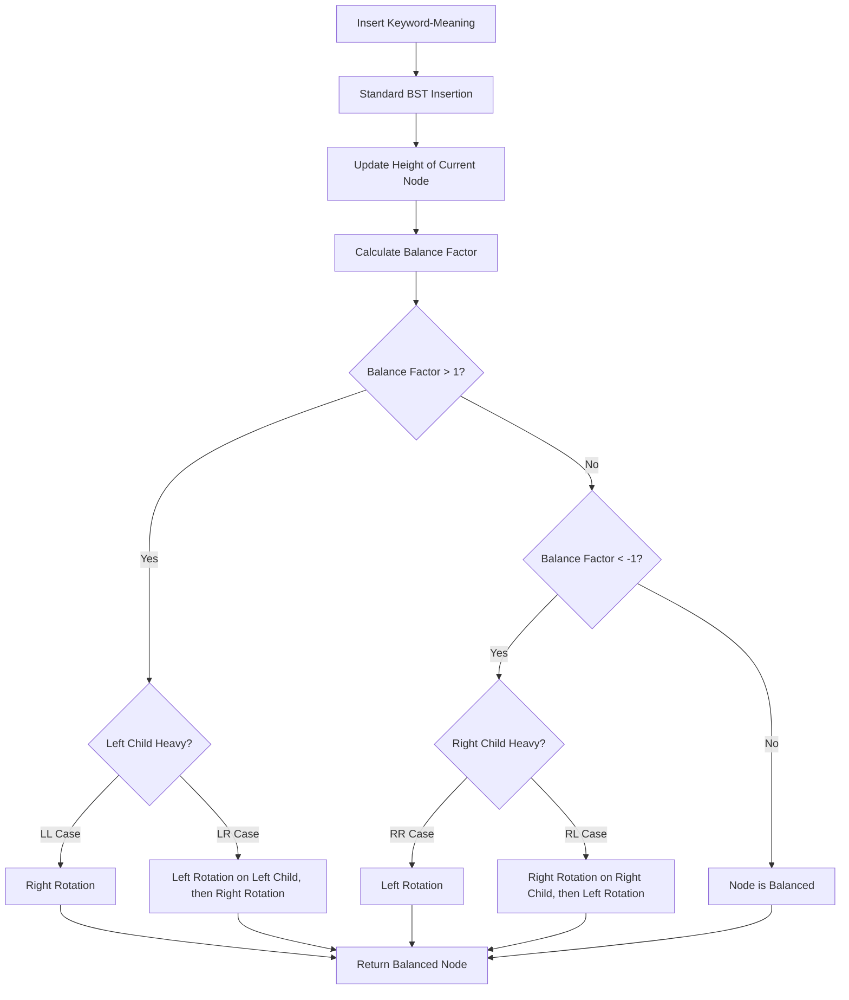
```mermaid
flowchart TD
    A[Insert Keyword-Meaning] --> B[Standard BST Insertion]
    B --> C[Update Height of Current Node]
    C --> D[Calculate Balance Factor]
    D --> E{Balance Factor > 1?}
    E -->|Yes| F{Left Child Heavy?}
    F -->|LL Case| G[Right Rotation]
    F -->|LR Case| H[Left Rotation on Left Child, then Right Rotation]
    E -->|No| I{Balance Factor < -1?}
    I -->|Yes| J{Right Child Heavy?}
    J -->|RR Case| K[Left Rotation]
    J -->|RL Case| L[Right Rotation on Right Child, then Left Rotation]
    I -->|No| M[Node is Balanced]
    G --> N[Return Balanced Node]
    H --> N
    K --> N
    L --> N
    M --> N
```

### AVL Rotation Cases
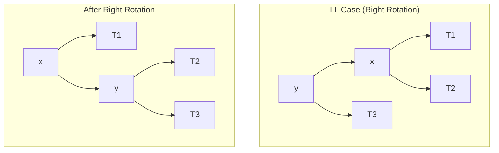
```mermaid
graph TD
    subgraph "LL Case (Right Rotation)"
    A1[y] --> B1[x]
    A1 --> C1[T3]
    B1 --> D1[T1]
    B1 --> E1[T2]
    end

    subgraph "After Right Rotation"
    A2[x] --> B2[T1]
    A2 --> C2[y]
    C2 --> D2[T2]
    C2 --> E2[T3]
    end
```

### Algorithm: Dictionary Operations
```
ALGORITHM: Search_Dictionary(root, keyword)
1. START
2. IF root == NULL THEN
   - PRINT "Keyword not found"
   - RETURN
3. SET comparison = COMPARE(keyword, root.keyword)
4. IF comparison == 0 THEN
   - PRINT "Found:", root.keyword, "=", root.meaning
5. ELSE IF comparison < 0 THEN
   - Search_Dictionary(root.left, keyword)
6. ELSE
   - Search_Dictionary(root.right, keyword)
7. END

ALGORITHM: Update_Dictionary(root, keyword, new_meaning)
1. START
2. SET root = AVL_Insert(root, keyword, new_meaning)
3. PRINT "Dictionary updated"
4. END
```

### Time Complexity Analysis
- **Search**: O(log n) guaranteed
- **Insert**: O(log n) guaranteed
- **Delete**: O(log n) guaranteed
- **Space**: O(n) for storage

---

## Practical 10: Heap Data Structure for Max/Min Marks {#practical-10}

### Concept Explanation
A **Heap** is a complete binary tree that satisfies the heap property:
- **Max Heap**: Parent ≥ all children (root has maximum value)
- **Min Heap**: Parent ≤ all children (root has minimum value)

**Complete Binary Tree**: All levels filled except possibly the last, which is filled left to right.

### Algorithm: Insert in Max Heap
```
ALGORITHM: Insert_Max_Heap(value)
1. START
2. IF heap is full THEN
   - PRINT "Heap overflow"
   - RETURN
3. SET heap[size] = value
4. SET index = size
5. INCREMENT size
6. // Heapify Up
7. WHILE index > 0 AND heap[(index-1)/2] < heap[index] DO
   a. SWAP heap[index] and heap[(index-1)/2]
   b. SET index = (index-1)/2
8. PRINT "Inserted:", value
9. END
```

### Algorithm: Insert in Min Heap
```
ALGORITHM: Insert_Min_Heap(value)
1. START
2. IF heap is full THEN
   - PRINT "Heap overflow"
   - RETURN
3. SET heap[size] = value
4. SET index = size
5. INCREMENT size
6. // Heapify Up
7. WHILE index > 0 AND heap[(index-1)/2] > heap[index] DO
   a. SWAP heap[index] and heap[(index-1)/2]
   b. SET index = (index-1)/2
8. PRINT "Inserted:", value
9. END
```

### Algorithm: Extract Maximum
```
ALGORITHM: Extract_Max(heap)
1. START
2. IF size == 0 THEN
   - PRINT "Heap is empty"
   - RETURN -1
3. SET max_value = heap[0]
4. SET heap[0] = heap[size-1]
5. DECREMENT size
6. CALL Max_Heapify(0)
7. RETURN max_value
8. END
```

### Algorithm: Max Heapify (Heapify Down)
```
ALGORITHM: Max_Heapify(index)
1. START
2. SET largest = index
3. SET left = 2 * index + 1
4. SET right = 2 * index + 2
5. IF left < size AND heap[left] > heap[largest] THEN
   - SET largest = left
6. IF right < size AND heap[right] > heap[largest] THEN
   - SET largest = right
7. IF largest != index THEN
   a. SWAP heap[index] and heap[largest]
   b. CALL Max_Heapify(largest)
8. END
```

### Algorithm: Build Heap from Array
```
ALGORITHM: Build_Max_Heap(marks[], n)
1. START
2. SET size = n
3. COPY marks[] to heap[]
4. SET start_index = (n/2) - 1  // Last non-leaf node
5. FOR i = start_index DOWN TO 0 DO
   - CALL Max_Heapify(i)
6. END
```

### Flowchart: Heap Operations
```mermaid
flowchart TD
    A[Start: Insert Mark] --> B[Add to End of Heap]
    B --> C[Get Parent Index = (i-1)/2]
    C --> D{Parent < Current?}
    D -->|Yes| E[Swap with Parent]
    E --> F[Move to Parent Position]
    F --> G{Reached Root?}
    G -->|No| D
    G -->|Yes| H[Insertion Complete]
    D -->|No| H

    I[Extract Max] --> J[Save Root Value]
    J --> K[Move Last Element to Root]
    K --> L[Reduce Heap Size]
    L --> M[Heapify Down from Root]
    M --> N[Find Largest among Node and Children]
    N --> O{Need to Swap?}
    O -->|Yes| P[Swap and Continue Down]
    P --> M
    O -->|No| Q[Heap Property Restored]
```

### Heap Structure Visualization
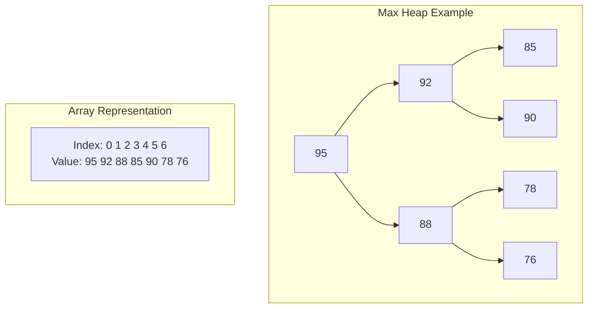
```mermaid
graph TD
    subgraph "Max Heap Example"
    A[95] --> B[92]
    A --> C[88]
    B --> D[85]
    B --> E[90]
    C --> F[78]
    C --> G[76]
    end

    subgraph "Array Representation"
    H["Index: 0  1  2  3  4  5  6<br/>Value: 95 92 88 85 90 78 76"]
    end
```

### Algorithm: Find Min and Max Marks
```
ALGORITHM: Find_Max_Min_Marks(marks[], n)
1. START
2. CREATE max_heap and min_heap
3. FOR i = 0 TO n-1 DO
   a. Insert_Max_Heap(marks[i])
   b. Insert_Min_Heap(marks[i])
4. SET max_marks = Get_Max_From_Max_Heap()
5. SET min_marks = Get_Min_From_Min_Heap()
6. PRINT "Maximum Marks:", max_marks
7. PRINT "Minimum Marks:", min_marks
8. END
```

### Time Complexity Analysis
- **Insert**: O(log n) - heapify up
- **Extract Max/Min**: O(log n) - heapify down
- **Get Max/Min**: O(1) - just return root
- **Build Heap**: O(n) - bottom-up approach
- **Space**: O(n) for heap storage

---

## Practical 11: Sequential File - Student Information {#practical-11}

### Concept Explanation
A **Sequential File** stores records one after another in a linear fashion. Access is sequential from the beginning, making it simple but potentially slow for large datasets.

**File Operations:**
- **Sequential Access**: Read records from beginning to end
- **Append**: Add new records at the end
- **Logical Deletion**: Mark records as deleted rather than physical removal

### Algorithm: Add Student Record
```
ALGORITHM: Add_Student()
1. START
2. CREATE student record structure
3. SET student.isDeleted = false
4. PRINT "Enter Roll No:"
5. INPUT student.rollNo
6. PRINT "Enter Name:"
7. INPUT student.name
8. PRINT "Enter Division:"
9. INPUT student.division
10. PRINT "Enter Address:"
11. INPUT student.address
12. OPEN file in binary append mode
13. WRITE student record to file
14. CLOSE file
15. PRINT "Student added successfully"
16. END
```

### Algorithm: Display All Students
```
ALGORITHM: Display_All_Students()
1. START
2. OPEN file in binary read mode
3. IF file doesn't exist THEN
   - PRINT "No records found"
   - RETURN
4. PRINT "--- All Students ---"
5. WHILE read student record from file DO
   a. IF student.isDeleted == false THEN
      - PRINT "Roll No:", student.rollNo
      - PRINT "Name:", student.name
      - PRINT "Division:", student.division
      - PRINT "Address:", student.address
      - PRINT "-------------------"
6. CLOSE file
7. END
```

### Algorithm: Search Student
```
ALGORITHM: Search_Student(rollNo)
1. START
2. SET found = false
3. OPEN file in binary read mode
4. WHILE read student record from file DO
   a. IF student.rollNo == rollNo AND student.isDeleted == false THEN
      - PRINT "Student Found:"
      - PRINT all student details
      - SET found = true
      - BREAK
5. IF found == false THEN
   - PRINT "Student not found"
6. CLOSE file
7. END
```

### Algorithm: Delete Student (Logical)
```
ALGORITHM: Delete_Student(rollNo)
1. START
2. SET found = false
3. OPEN file in binary read-write mode
4. WHILE read student record from file DO
   a. IF student.rollNo == rollNo AND student.isDeleted == false THEN
      - SET student.isDeleted = true
      - SEEK back by size of one record
      - WRITE updated student record
      - SET found = true
      - PRINT "Student deleted successfully"
      - BREAK
5. IF found == false THEN
   - PRINT "Student not found"
6. CLOSE file
7. END
```

### Flowchart: Sequential File Operations
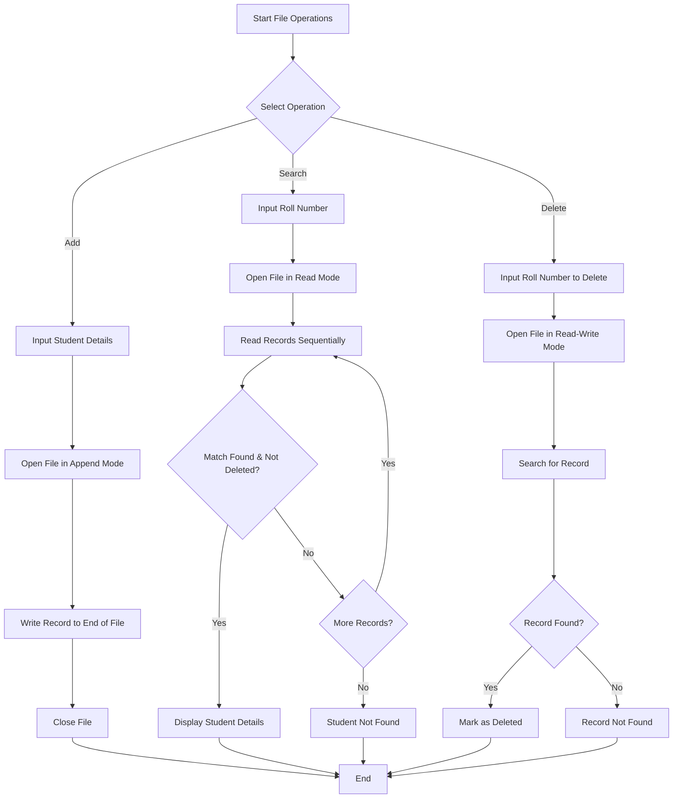
```mermaid
flowchart TD
    A[Start File Operations] --> B{Select Operation}
    B -->|Add| C[Input Student Details]
    C --> D[Open File in Append Mode]
    D --> E[Write Record to End of File]
    E --> F[Close File]

    B -->|Search| G[Input Roll Number]
    G --> H[Open File in Read Mode]
    H --> I[Read Records Sequentially]
    I --> J{Match Found & Not Deleted?}
    J -->|Yes| K[Display Student Details]
    J -->|No| L{More Records?}
    L -->|Yes| I
    L -->|No| M[Student Not Found]

    B -->|Delete| N[Input Roll Number to Delete]
    N --> O[Open File in Read-Write Mode]
    O --> P[Search for Record]
    P --> Q{Record Found?}
    Q -->|Yes| R[Mark as Deleted]
    Q -->|No| S[Record Not Found]

    F --> T[End]
    K --> T
    M --> T
    R --> T
    S --> T
```

### File Structure Layout
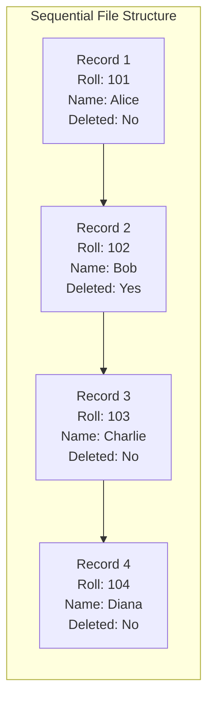
```mermaid
graph LR
    subgraph "Sequential File Structure"
    A["Record 1<br/>Roll: 101<br/>Name: Alice<br/>Deleted: No"] --> B["Record 2<br/>Roll: 102<br/>Name: Bob<br/>Deleted: Yes"] --> C["Record 3<br/>Roll: 103<br/>Name: Charlie<br/>Deleted: No"] --> D["Record 4<br/>Roll: 104<br/>Name: Diana<br/>Deleted: No"]
    end
```

### Algorithm: File Compaction (Remove Deleted Records)
```
ALGORITHM: Compact_File()
1. START
2. OPEN original file in read mode
3. CREATE temporary file in write mode
4. WHILE read student record from original file DO
   a. IF student.isDeleted == false THEN
      - WRITE student record to temporary file
5. CLOSE both files
6. DELETE original file
7. RENAME temporary file to original filename
8. PRINT "File compacted successfully"
9. END
```

### Time Complexity Analysis
- **Add Record**: O(1) - append at end
- **Search Record**: O(n) - linear search
- **Delete Record**: O(n) - search + mark as deleted
- **Display All**: O(n) - read all records
- **Space**: O(n) for n records

---

## Practical 12: Indexed Sequential File - Employee Information {#practical-12}

### Concept Explanation
**Indexed Sequential File** combines the benefits of sequential and direct access by maintaining:
1. **Data File**: Stores actual employee records sequentially
2. **Index File**: Stores keys (employee IDs) and their positions in data file

**Advantages:**
- Faster search than pure sequential (O(log n) if index is sorted)
- Maintains sequential order for range queries
- Efficient for both random and sequential access

### Algorithm: Add Employee Record
```
ALGORITHM: Add_Employee()
1. START
2. CREATE employee record
3. PRINT "Enter Employee ID:"
4. INPUT employee.empId
5. PRINT "Enter Name:"
6. INPUT employee.name
7. PRINT "Enter Designation:"
8. INPUT employee.designation
9. PRINT "Enter Salary:"
10. INPUT employee.salary
11. OPEN data file in binary append mode
12. GET current position = file pointer position
13. WRITE employee record to data file
14. CLOSE data file
15. CREATE index entry with empId and position
16. OPEN index file in binary append mode
17. WRITE index entry to index file
18. CLOSE index file
19. PRINT "Employee added successfully"
20. END
```

### Algorithm: Search Employee
```
ALGORITHM: Search_Employee(empId)
1. START
2. SET found = false
3. SET position = -1
4. OPEN index file in binary read mode
5. WHILE read index entry from index file DO
   a. IF index.empId == empId THEN
      - SET position = index.position
      - SET found = true
      - BREAK
6. CLOSE index file
7. IF found == false THEN
   - PRINT "Employee not found"
   - RETURN
8. OPEN data file in binary read mode
9. SEEK to position in data file
10. READ employee record from data file
11. CLOSE data file
12. PRINT "Employee Details:"
13. PRINT all employee information
14. END
```

### Algorithm: Delete Employee
```
ALGORITHM: Delete_Employee(empId)
1. START
2. // First, remove from index
3. CREATE temporary index file
4. SET found = false
5. OPEN original index file in read mode
6. OPEN temporary index file in write mode
7. WHILE read index entry from original index DO
   a. IF index.empId != empId THEN
      - WRITE index entry to temporary index file
   b. ELSE
      - SET found = true
8. CLOSE both index files
9. IF found == true THEN
   a. DELETE original index file
   b. RENAME temporary index file to original
   c. PRINT "Employee deleted successfully"
10. ELSE
   a. DELETE temporary index file
   b. PRINT "Employee not found"
11. END
```

### Algorithm: Display All Employees
```
ALGORITHM: Display_All_Employees()
1. START
2. OPEN data file in binary read mode
3. IF file doesn't exist THEN
   - PRINT "No records found"
   - RETURN
4. PRINT "--- All Employees ---"
5. WHILE read employee record from data file DO
   a. PRINT "ID:", employee.empId
   b. PRINT "Name:", employee.name
   c. PRINT "Designation:", employee.designation
   d. PRINT "Salary:", employee.salary
   e. PRINT "-------------------"
6. CLOSE data file
7. END
```

### Flowchart: Indexed Sequential File Operations
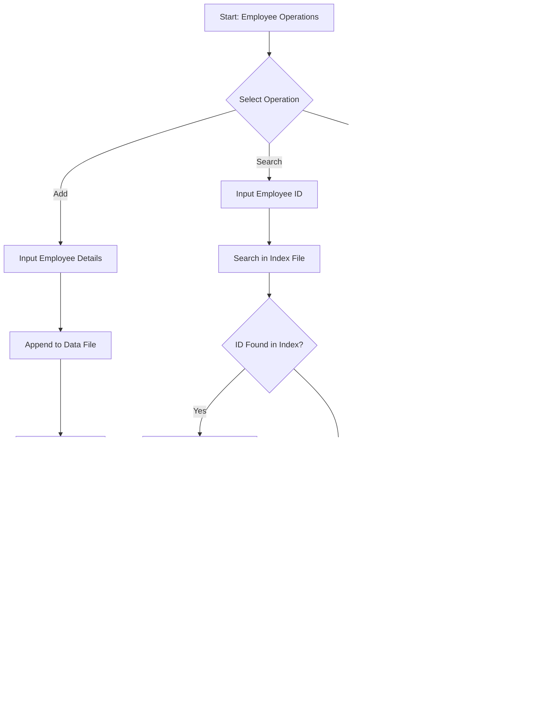
```mermaid
flowchart TD
    A[Start: Employee Operations] --> B{Select Operation}
    B -->|Add| C[Input Employee Details]
    C --> D[Append to Data File]
    D --> E[Get File Position]
    E --> F[Create Index Entry]
    F --> G[Append to Index File]
    G --> H[Addition Complete]

    B -->|Search| I[Input Employee ID]
    I --> J[Search in Index File]
    J --> K{ID Found in Index?}
    K -->|Yes| L[Get Position from Index]
    L --> M[Seek to Position in Data File]
    M --> N[Read Employee Record]
    N --> O[Display Employee Details]
    K -->|No| P[Employee Not Found]

    B -->|Delete| Q[Input Employee ID to Delete]
    Q --> R[Create Temporary Index File]
    R --> S[Copy All Entries Except Target ID]
    S --> T[Replace Original Index File]
    T --> U[Deletion Complete]

    H --> V[End]
    O --> V
    P --> V
    U --> V
```

### File Structure Organization
```mermaid
graph TD
    subgraph "Data File (employees.dat)"
    A["Pos 0: ID=101, Name=John, Salary=50000"]
    B["Pos 64: ID=102, Name=Jane, Salary=55000"]
    C["Pos 128: ID=103, Name=Bob, Salary=48000"]
    end

    subgraph "Index File (index.dat)"
    D["ID=101, Position=0"]
    E["ID=102, Position=64"]
    F["ID=103, Position=128"]
    end

    D --> A
    E --> B
    F --> C
```

### Algorithm: Sort Index for Better Performance
```
ALGORITHM: Sort_Index_File()
1. START
2. READ all index entries into memory array
3. SORT array by employee ID using any sorting algorithm
4. OPEN index file in write mode
5. FOR each entry in sorted array DO
   - WRITE entry to index file
6. CLOSE index file
7. PRINT "Index file sorted successfully"
8. END
```

### Algorithm: Binary Search on Sorted Index
```
ALGORITHM: Binary_Search_Index(empId)
1. START
2. LOAD all index entries into array
3. SET left = 0, right = number_of_entries - 1
4. WHILE left <= right DO
   a. SET mid = (left + right) / 2
   b. IF array[mid].empId == empId THEN
      - RETURN array[mid].position
   c. ELSE IF array[mid].empId < empId THEN
      - SET left = mid + 1
   d. ELSE
      - SET right = mid - 1
5. RETURN -1  // Not found
6. END
```

### Time Complexity Analysis
- **Add Employee**: O(1) - append operations
- **Search Employee**: 
  - With unsorted index: O(n)
  - With sorted index: O(log n)
- **Delete Employee**: O(n) - rebuild index file
- **Display All**: O(n) - sequential read of data file
- **Space**: O(n) for data + O(n) for index

---

## Summary of Data Structures Comparison

### Performance Comparison Table

| Data Structure | Search | Insert | Delete | Space | Best Use Case |
|---------------|--------|--------|--------|-------|---------------|
| Hash Table | O(1) avg | O(1) avg | O(1) avg | O(n) | Fast lookup, no ordering needed |
| BST | O(log n) avg | O(log n) avg | O(log n) avg | O(n) | Ordered data, range queries |
| AVL Tree | O(log n) | O(log n) | O(log n) | O(n) | Guaranteed balance, frequent searches |
| Heap | O(n) | O(log n) | O(log n) | O(n) | Priority queues, finding min/max |
| Graph (Matrix) | O(1) | O(1) | O(1) | O(V²) | Dense graphs, edge queries |
| Graph (List) | O(V) | O(1) | O(V) | O(V+E) | Sparse graphs, graph traversal |
| Sequential File | O(n) | O(1) | O(n) | O(n) | Simple storage, append-heavy |
| Indexed Sequential | O(log n) | O(1) | O(n) | O(n) | Sorted access with fast search |

### Key Concepts for Oral Exam

#### Tree Traversals
1. **Inorder (Left-Root-Right)**: Gives sorted order in BST
2. **Preorder (Root-Left-Right)**: Used for copying tree structure
3. **Postorder (Left-Right-Root)**: Used for deleting tree, expression evaluation
4. **Level Order**: BFS traversal, uses queue

#### Graph Algorithms
- **DFS**: Stack-based, explores depth-first, good for connectivity
- **BFS**: Queue-based, explores breadth-first, shortest path in unweighted graphs
- **Applications**: Cycle detection, topological sorting, shortest paths

#### File Organization Methods
1. **Sequential**: Simple, good for batch processing
2. **Direct/Random**: Fast access with key, good for real-time systems
3. **Indexed Sequential**: Combines benefits of both, good for mixed access patterns

### Common Oral Exam Questions

1. **Why use AVL over regular BST?**
   - Guarantees O(log n) performance even with sorted input
   - Prevents degeneration into linked list

2. **When to use Hash Table vs BST?**
   - Hash Table: When you only need fast lookup, no ordering required
   - BST: When you need ordered traversal, range queries

3. **DFS vs BFS applications?**
   - DFS: Finding paths, detecting cycles, topological sorting
   - BFS: Shortest path in unweighted graphs, level-order processing

4. **Max Heap vs Min Heap?**
   - Max Heap: Priority queues where highest priority is maximum
   - Min Heap: Priority queues where highest priority is minimum

5. **Sequential vs Indexed Sequential Files?**
   - Sequential: Simple, good for small files or batch processing
   - Indexed Sequential: Better for large files with frequent searches

### Tips for Practical Exam

1. **Understand the Why**: Don't just memorize algorithms, understand why each data structure is used
2. **Trace Examples**: Be ready to trace through algorithms with small examples
3. **Know Complexities**: Memorize time and space complexities for all operations
4. **Compare Alternatives**: Be able to explain trade-offs between different approaches
5. **Practice Drawing**: Trees, graphs, hash tables - visual representation is important
6. **File Handling**: Understand difference between text and binary modes, file positioning

---

**Good Luck with Your SPPU DSAL Oral Practical Exam!**

Remember: Focus on understanding concepts rather than just memorizing code. Be prepared to explain your choice of data structure and algorithm for given scenarios.